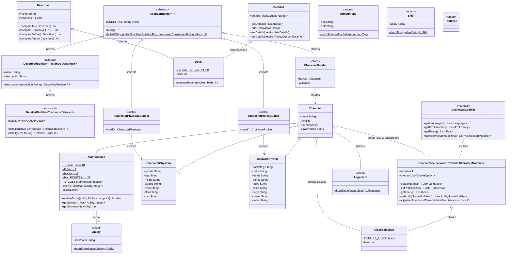

<!-- docs/diagrams/class_diagram.md -->

```mermaid
classDiagram

  %% \/\/\/\/\/\/\/\/\/\/\/\/\/\/\/\/\/\/\/\/\/\/\/\/\/\/\/\/\/\/\/\/\/\/\/ %%
  %% ============================== Classes  ============================== %%
  %% /\/\/\/\/\/\/\/\/\/\/\/\/\/\/\/\/\/\/\/\/\/\/\/\/\/\/\/\/\/\/\/\/\/\/\ %%

  %% -------------------------------- Note -------------------------------- %%
  %% Most disinteresting getters, setters, constructors and overly complex 
  %% generics/types have been omitted from the class diagram for readability.
  %% -------------------------------- .... -------------------------------- %%

  %% ====================================================================== %%
  %% ------------------------------ Builders ------------------------------ %%
  %% ====================================================================== %%

  class AbstractBuilder~T~ {
    <<abstract>>
    #UNDEFINED String = null$
    +build() T*
    %% Below method simplified a little for readability
    #buildWith(supplier Supplier~Builder~R~~, consumer Consumer~Builder~R~~) R$
  }

  class DescribedBuilder~T extends Described~ {
    <<abstract>>
    #name String
    #description String
    +description(description String) DescribedBuilder~T~
  }

  class DetailedBuilder~T extends Detailed~ {
    <<abstract>>
    #details PriorityQueue~Detail~
    +details(details List~Detail~) DetailedBuilder~T~
    +detail(detail Detail) DetailedBuilder~T~
  }

  %% ====================================================================== %%
  %% ----------------------------- Character  ----------------------------- %%
  %% ====================================================================== %%

  class AbilityScores {
    -DEFAULT int = 10$
    -MIN int = 8$
    -MAX int = 15$
    -MAX_POINTS int = 27$
    -PB_COST Map~Integer.Integer~$
    -scores HashMap~Ability.Integer~
    -pointsLeft int

    +updateScore(ability Ability, change int) boolean
    +getScores() Map~Ability.Integer~
    +getScore(ability Ability) int
  }

  class Character {
    -name String
    -level int
    -experience int
    -playerName String
  }
  
  class CharacterModifier {
    <<interface>>
    %% Below methods have 'default' implementations that return empty lists
    +getLanguages() List~Language~
    +getProficiencies() List~Proficiency~
    +getFeats() List~Feat~
    +getAbilityScoreModifiers() List~AbilityScoreModifier~
  }

  class CharacterPhysique {
    -gender String
    -age String
    -height String
    -weight String
    -eyes String
    -skin String
    -hair String
  }

  class CharacterProfile {
    -backstory String
    -traits String
    -ideals String
    -bonds String
    -flaws String
    -allies String
    -deity String
    -trinket String
    -notes String
  }

  class CharacterSelection~T extends CharacterModifier~ {
    %% Below attributes are final
    -template T
    -choices List~ChoiceOption~

    +getLanguages() List~Language~
    +getProficiencies() List~Proficiency~
    +getFeats() List~Feat~
    +getAbilityScoreModifiers() List~AbilityScoreModifier~
    -all(getter Function~CharacterModifier.List~X~~) List~X~
  }

  class ClassSelection {
    -DEFAULT_LEVEL int = 1$
    -level int
  }

  %% ----------------------- Nested Class Builders  ----------------------- %%

  AbstractBuilder <|-- CharacterBuilder                     : inherits 
  CharacterBuilder --> Character                            : creates
  class CharacterBuilder {
    <<static>>
    +build() Character
    -validate()
  }

  AbstractBuilder <|-- CharacterPhysiqueBuilder             : inherits 
  CharacterPhysiqueBuilder --> CharacterPhysique            : creates
  class CharacterPhysiqueBuilder {
    <<static>>
    +build() CharacterPhysique
  }

  AbstractBuilder <|-- CharacterProfileBuilder              : inherits 
  CharacterProfileBuilder --> CharacterProfile              : creates
  class CharacterProfileBuilder {
    <<static>>
    +build() CharacterProfile
  }

  %% ====================================================================== %%
  %% --------------------------- Core  Elements --------------------------- %%
  %% ====================================================================== %%

  class Described {
    %% Implements comparable
    #name String
    #description String
    +compareTo(o Described) int
    %% compareNullable Comparable types simplified here for readability
    #compareNullable(a T, b T) int
    #compareBefore(o Described) int
    #compareAfter(o Described) int
  }

  class Detail {
    -DEFAULT_ORDER int = 0$
    -order int
    %% Overides to compare using 'order' attribute first
    #compareBefore(o Described) int
  }

  class Detailed {
    #details PriorityQueue~Detail~
    +getDetails() List~Detail~
    +addDetail(detail Detail)
    +setDetails(details List~Detail~)
    +setDetails(details PriorityQueue~Detail~)
  }

  %% ====================================================================== %%
  %% ---------------------------- Enumerations ---------------------------- %%
  %% ====================================================================== %%

  class Ability {
    <<enum>>
    -shorthand String
    +fromString(value String) Ability$
  }

  class Alignment {
    <<enum>>
    +fromString(value String) Alignment$
  }

  class ArmourType {
    <<enum>>
    -don String
    -doff String
    +fromString(value String) ArmourType$
  }

  class Skill {
    <<enum>>
    -ability Ability
    +fromString(value String) Skill$
  }

  class ToolType {
    <<enum>>
  }

  %% \/\/\/\/\/\/\/\/\/\/\/\/\/\/\/\/\/\/\/\/\/\/\/\/\/\/\/\/\/\/\/\/\/\/\/ %%
  %% =================== Relationships and Dependencies =================== %%
  %% /\/\/\/\/\/\/\/\/\/\/\/\/\/\/\/\/\/\/\/\/\/\/\/\/\/\/\/\/\/\/\/\/\/\/\ %%

  %% ------------------------------ Builders ------------------------------ %%

  AbstractBuilder <|-- DescribedBuilder                     : inherits
  DescribedBuilder <|-- DetailedBuilder                     : inherits

  %% ----------------------------- Character  ----------------------------- %%

  AbilityScores "*" -- "6" Ability                          : score

  Character "1" o-- "1" AbilityScores
  Character "*" -- "1" Alignment                            : follows
  Character "1" o-- "1" CharacterPhysique
  Character "1" o-- "1" CharacterProfile
  Character "1" o-- "2" CharacterSelection      : select race & background
  Character "1" o-- "1..*" ClassSelection       : selects classes

  CharacterModifier <|.. CharacterSelection                 : realises
  CharacterSelection <|-- ClassSelection                    : inherits

  %% --------------------------- Core  Elements --------------------------- %%

  Described <|-- Detail                                     : inherits
  Detailed "1" o-- "*" Detail                               : encompasses

```
