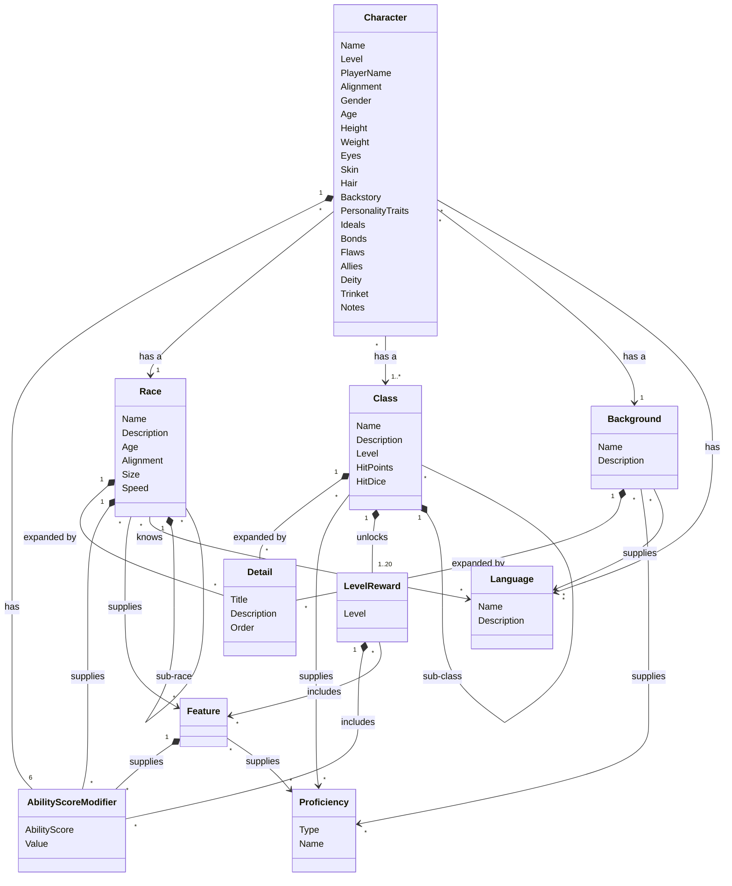

```mermaid
classDiagram
  %% -------------------------------- Note -------------------------------- %%
  
  %% Equipment (including weapons) and magic (spells + cantrips) have been 
  %% omitted from the current design, to keep things simpler at this stage.

  %% AC implementation is not currently considered as well.

  %% \/\/\/\/\/\/\/\/\/\/\/\/\/\/\/\/\/\/\/\/\/\/\/\/\/\/\/\/\/\/\/\/\/\/\/ %%
  %% =================== Relationships and Dependencies =================== %%
  %% /\/\/\/\/\/\/\/\/\/\/\/\/\/\/\/\/\/\/\/\/\/\/\/\/\/\/\/\/\/\/\/\/\/\/\ %%

  Character "1" *-- "6" AbilityScoreModifier : has
  Character "*" --> "1" Race : has a
  Character "*" --> "1..*" Class : has a 
  Character "*" --> "1" Background : has a
  %% Assume all characters speak Common by default, thus 0-to-many fine
  Character "*" --> "*" Language : has

  %% The following adjust the equipment, stats, and features of a character
  %% Race --|> CharacterModifier : is a
  %% Class --|> CharacterModifier : is a
  %% Background --|> CharacterModifier : is a

  %% Additional information text fields
  Race "1" *-- "*" Detail : expanded by 
  Class "1" *-- "*" Detail : expanded by 
  Background "1" *-- "*" Detail : expanded by 

  Race "1" *-- "*" AbilityScoreModifier: supplies
  Race "*" --> "*" Feature: supplies
  Race "*" --> "*" Language: knows

  Class "*" --> "*" Proficiency: supplies
  %% Classes/subclasses aren't guaranteed to have a level reward every level up
  Class "1" *-- "1..20" LevelReward: unlocks 
  %% Equipment

  Background "*" --> "*" Proficiency: supplies
  Background "*" --> "*" Language: supplies
  %% Equipment

  Feature "1" *-- "*" AbilityScoreModifier: supplies
  Feature "*" --> "*" Proficiency: supplies

  LevelReward "1" *-- "*" AbilityScoreModifier: includes
  LevelReward "*" --> "*" Feature: includes
  %% TODO: Subclass unlock not included here for the time being

  Race "1" *-- "*" Race : sub-race 
  Class "1" *-- "*" Class : sub-class

  %% \/\/\/\/\/\/\/\/\/\/\/\/\/\/\/\/\/\/\/\/\/\/\/\/\/\/\/\/\/\/\/\/\/\/\/ %%
  %% ============================== Classes  ============================== %%
  %% /\/\/\/\/\/\/\/\/\/\/\/\/\/\/\/\/\/\/\/\/\/\/\/\/\/\/\/\/\/\/\/\/\/\/\ %%

  class Character {
    Name
    Level
    PlayerName
    %% Alignment is an Enum - {Lawful, Neutral, Chaotic} x {Good, Neutral, Evil}
    Alignment

    %% Visual descriptors
    Gender
    Age
    Height
    Weight
    Eyes
    Skin
    Hair

    %% Additional details
    Backstory
    PersonalityTraits
    Ideals
    Bonds
    Flaws
    %% Allies & Organisations combined into one field here
    Allies
    %% String to allow customisation here, but list of known deities also exists
    Deity
    Trinket
    Notes
  }

  class AbilityScoreModifier {
    %% AbilityScore is an Enum - {Str, Dex, Con, Int, Wis, Cha}
    AbilityScore
    %% +/- upon default 10
    Value
  }

  class Proficiency {
    %% Superset of Armor, Weapon, Tool & Skill proficiencies
    %% Enum - {Armor, Weapon, Tool, Skill}
    Type
    %% Enum - [Dependent on Type]
    %% e.g. Skill - {Acrobatics, Animal Handling, Arcana, Athletics, Deception, 
    %%          History, Insight, Intimidation, Investigation, Medicine, Nature,
    %%          Perception, Performance, Persuasion, Religion, Sleight of Hand, 
    %%          Stealth, Survival}
    Name
  }

  class Race {
    Name
    Description
    %% Traits
    Age
    Alignment
    Size
    Speed
  }

  class Class { 
    Name
    Description
    %% Level separate from Character level to allow multiclassing
    Level
    HitPoints
    HitDice
  }

  class Background {
    Name
    Description
    %% TODO: Variants / Variant Features need to be added here
    %% Recommended, enumerated options for 'Additional details'
    %% Trait1
    %% Trait2
    %% Ideal
    %% Bond
    %% Flaw
  }

  class Language {
    Name
    Description
  }

  %% ---------------------------- WIP  Classes ---------------------------- %%

  %% class Inventory { 
  %%   AdditionalTreasure
  %%   QuestItems
  %% }
  %% class Wallet { }
  %% class Item { }
  %% class Equipment { 
  %%   Equiped
  %% }
  %% class Weapon { }
  %% class Armor { }

  %% ------------------------ Implementation Classes ---------------------- %%

  %% class CharacterModifier {
  %%   %% Abstract class providing adjustments to character stats and details.
  %%   %% Adjustments can be retrieved from classes extending this.
  %% }

  class Detail {
    Title
    Description
    %% Optional number field to hardcode cumulative detail ordering
    Order
  }

  class LevelReward {
    Level
  }
```
